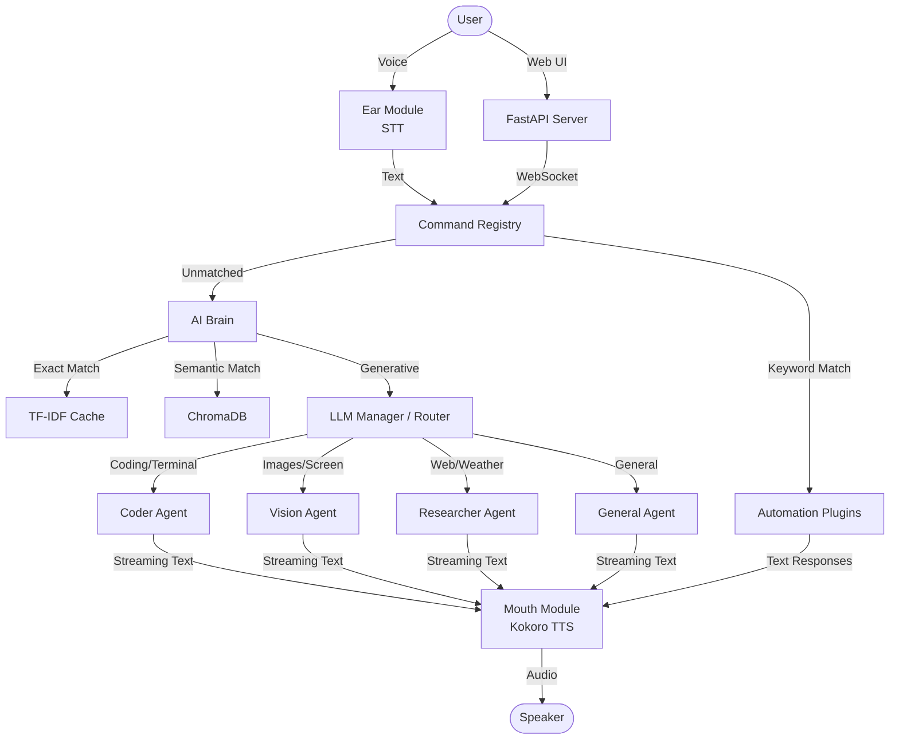

# Jarvis 2.0 - Advanced Personal AI Voice Assistant

Jarvis 2.0 is a highly advanced, ultra-low latency voice-controlled AI assistant written in Python 3.11. It is designed to act as a seamless digital companion, featuring true token-level streaming, asynchronous audio pipelining, and a powerful multi-tier LLM architecture.

## 🌟 Core Features

* **Biometric Face Authentication (Security & Anti-Spoofing)**
  Secured with dlib-based 68-point facial landmark tracking and `face_recognition` models. The system computes real-time Eye Aspect Ratio (EAR) to detect physical blinks (liveness verification), preventing static photos from bypassing authentication. Processed frames are downscaled by 4x with frame-rate throttling to limit CPU consumption to near 0%, avoiding GIL contention and audio cracking.
* **Instant Voice Synthesis (Pipelined Kokoro-ONNX)**
  Experience zero-gap conversational fluidity. Jarvis utilizes a two-stage asynchronous audio pipeline: while one sentence is being played, the next is generated in the background using the offline, high-quality Kokoro TTS model.
* **Intelligent Multi-Agent System**
  The built-in LLM Manager acts as a semantic router, seamlessly delegating your queries to specialized sub-agents (`Coder`, `Vision`, `Researcher`, and `General`). Each agent has unique system prompts and specific tool access to maximize precision and capability.
* **React Web UI & Terminal Integration**
  Jarvis provides a gorgeous, sci-fi inspired React interface running on a dedicated FastAPI server (port 1410). It features dual-stream rendering—spoken text animates to match the audio, while code blocks appear instantly with full syntax highlighting. The UI receives real-time bidirectional WebSocket telemetry (live CPU, RAM, Network stats) and offers 4 built-in CSS themes (`cyan`, `amber`, `minimal`, `oled`) configured via `config.json`.
* **Secure Code & Local Workspace Execution**
  The Coder and General Agents can write, debug, and execute code, as well as read/write files directly on your local host filesystem using robust Workspace Tools. Execution is safeguarded by a strict UI Permission Gate inside the React Web interface, ensuring you have explicit visual control over what code or file operations are allowed to run.
* **Advanced Speech Recognition**
  Features automatic ambient noise calibration, dynamic energy thresholding, and offline fallbacks using PocketSphinx, ensuring Jarvis perfectly understands you even in noisy environments.
* **Event-Driven Architecture**
  A modular internal Event Bus decouples voice operations, system events, and the internal Web UI Server for robust, thread-safe background execution.

## ⚙️ Intelligent Automations

Jarvis isn't just a chatbot; it actively controls your digital environment:
* **Agent Toolkit:** The Multi-Agent system has access to powerful capabilities via function calling:
  * **Code & Workspace:** Write/view/edit files, list directories, run terminal commands, and execute Python/C/C++/JS scripts in secure temp environments.
  * **System Control:** Battery checks, CPU/RAM monitoring, screen captures, volume/mute control, window management, and opening/closing applications.
  * **Media Control:** Built-in Local Music Player (play, shuffle, track management) and YouTube Automation (search, play, pause, captions, fullscreen via PyAutoGUI).
  * **Productivity:** Google Calendar (add/read events), Gmail (read unread, send emails), and Task Scheduling.
  * **Information & Utilities:** Google Web Search, Weather, Realtime News parsing, Current Location tracking, and integrated Wikipedia searching.
* **Creative Text-to-Image:** Unified image manager routing prompts seamlessly to Pollinations AI (Flux), Cloudflare AI (Flux-1-Schnell), and Stability AI (Stable Diffusion XL).
* **Context-Aware Memory:**
  * **RAG System:** Dual-layer RAG system (TF-IDF + ChromaDB). You can directly upload documents via the React UI to build his permanent knowledge base.
  * **Short/Long-term Memory:** Save and recall user facts using local JSON storage and Groq-powered natural summarization.
* **Proactive Assistance:** The built-in `ProactiveManager` runs a background thread to poll Google Calendar and your Gmail inbox every 120 seconds, proactively notifying you of upcoming events or important unread emails without you needing to ask.
* **File Management:** Search for files across directories, clear temporary folders, check disk sizes, and manage utilities.
* **Misc:** Fully integrated Alarms, Reminders, Internet Speed diagnostics, Date/Time parsing, and even telling Jokes.

## 📋 Prerequisites

* **Python 3.11** (Required. Python 3.12+ may have compatibility issues with `pyaudio` and legacy speech libraries).
* A working microphone and speakers.

## 🚀 Installation

1. **Clone the repository:**
   ```bash
   git clone https://github.com/Arnab27622/Jarvis-2.0.git
   cd Jarvis-2.0
   ```

2. **Create and activate a virtual environment (Python 3.11):**
   ```bash
   python -m venv .venv
   .venv\Scripts\activate
   ```

3. **Install dependencies:**
   ```bash
   pip install -r requirements.txt
   ```
   *Note: If `pyaudio` fails to install on Windows, you may need to install the appropriate wheel manually or use conda.*

4. **Setup Environment Variables:**
   Create a `.env` file in the root directory. Configure keys based on your desired features:
   ```env
    # Automations
    YOUTUBE_API_KEY=your_youtube_api_key_here
    WEATHER_API_KEY=your_weather_api_key_here
    SERPAPI_API_KEY=your_serpapi_api_key_here
    NEWS_API_KEY=your_news_api_key_here

    # Core LLMs
    GEMINI_API_KEY=your_gemini_api_key_here
    GROQ_API_KEY=your_groq_api_key_here

    # Image Generation Models (Cloudflare, Pollination, and Stability )
    CLOUDFLARE_ACCOUNT_ID=your_cloudflare_account_id_here
    CLOUDFLARE_API_TOKEN=your_cloudflare_api_token_here
    POLLINATION_API_KEY=your_pollinations_api_key_here
    STABILITY_API_KEY=your_stability_api_key_here
   ```

5. **Download Kokoro ONNX Models:**
   Place the Kokoro TTS models inside the `models/` directory:
   - `models/kokoro-v1.0.onnx`
   - `models/voices-v1.0.bin`

6. **Setup Owner Biometric Photo:**
   Place a clear front-facing reference image of yourself (the owner) at:
   - `data/images/owner.jpg`
   *(This image is utilized by the face recognition engine to authenticate the user at boot. See [UPDATE_FACE_GUIDE.md](UPDATE_FACE_GUIDE.md) for detailed instructions).*

## 🎙️ Usage

Start the assistant by running:
```bash
python main.py
```
Wait for the initial system diagnostics (Battery monitoring, Voice Module loading) to complete. You will hear a short Sci-Fi acknowledgment chirp the moment Jarvis detects a command.

## 📂 Codebase Structure
The entire project has been systematically documented with detailed inline comments and module-level docstrings for developer clarity.



- `main.py`: Main entry loop, Web UI initialization, and subsystem restoration.
- `jarvis-ui/`: The modern React/Vite web interface that connects to the FastAPI backend via WebSockets.
- `assistant/agents/`: Specialized AI personas (Coder, Vision, Researcher, General) with customized instructions and toolsets.
- `assistant/core/`: The core engine:
  - `brain.py` / `llm_manager.py`: Multi-agent orchestration, context memory, and streaming logic.
  - `mouth.py`: The unified dual-stage Kokoro TTS pipeline (runs ONNX inference and PyGame playback in separate background threads for zero-latency audio).
  - `ear.py`: Advanced speech recognition and noise calibration.
  - `event_bus.py`: The central Pub/Sub message broker featuring 15+ internal events (e.g., `SPEAK`, `USER_VOICE`, `SYS_METRICS`) that decouple the UI from the AI logic.
  - `registry.py`: The command router featuring a 3-Tier matching system (Keyword literal match → Regex with extraction → Rapidfuzz fuzzy matching).
- `assistant/interface/`: Command regex routing, wake-word detection, and welcome logic.
- `assistant/automation/`: A vast array of integrations spanning App Control, Web Search, Text-to-Image, and background tasks.
- `assistant/activities/`: System hardware diagnostics, battery tracking, and user activity logging.

## 🛠️ Troubleshooting

- **PyAudio Installation Fails (Windows):** If `pip install pyaudio` fails with a C++ compiler error, download the precompiled wheel from Christoph Gohlke's archive or install via `conda install pyaudio`.
- **ONNXRuntime CUDA DLL Errors:** If you see errors about missing `cublas64_12.dll` or `cublasLt64_12.dll`, Kokoro TTS requires the NVIDIA CUDA 12.x toolkit and cuDNN 9.x. Ensure they are installed and in your system `PATH`.
- **PocketSphinx Errors:** If PocketSphinx fails to build, make sure you have Swig installed, or find a pre-compiled Windows wheel for your Python version.

## 🤝 Contributing

We welcome contributions! Please see our [Contributing Guide](CONTRIBUTING.md) for details on how to set up your dev environment, add new voice commands, and integrate new LLM providers.

---
*Built by Arnab Dey*
