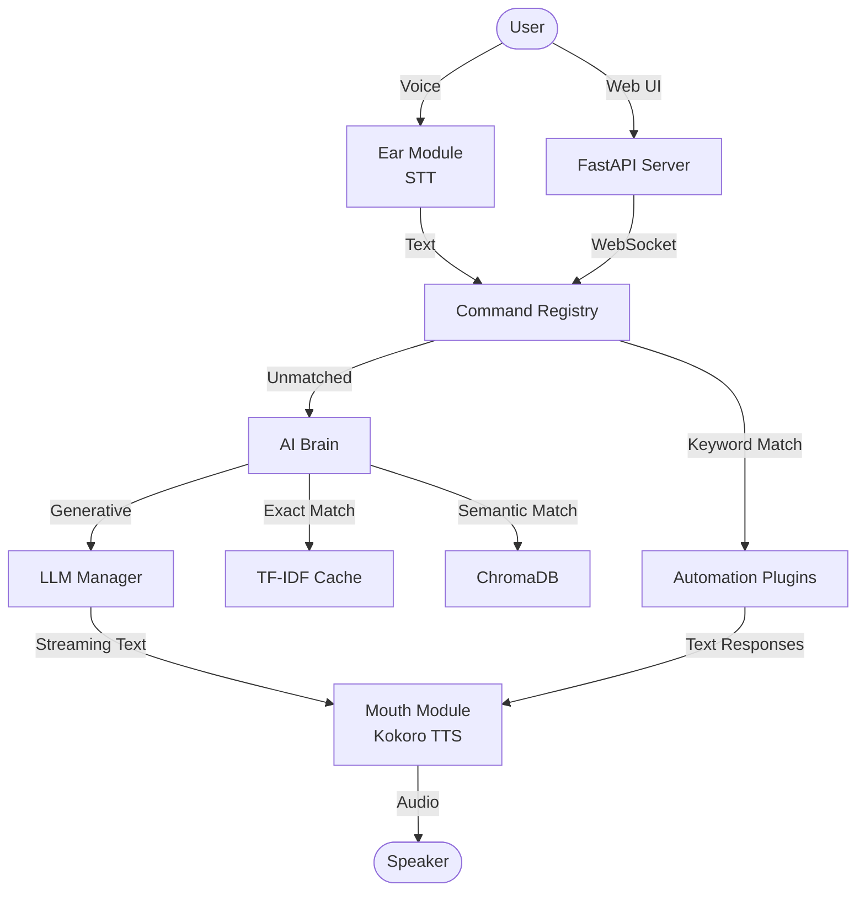

# Jarvis 2.0 - Advanced Personal AI Voice Assistant

Jarvis 2.0 is a highly advanced, ultra-low latency voice-controlled AI assistant written in Python 3.11. It is designed to act as a seamless digital companion, featuring true token-level streaming, asynchronous audio pipelining, and a powerful multi-tier LLM architecture.

## 🌟 Core Features

* **Instant Voice Synthesis (Pipelined Kokoro-ONNX)**
  Experience zero-gap conversational fluidity. Jarvis utilizes a two-stage asynchronous audio pipeline: while one sentence is being played, the next is generated in the background using the offline, high-quality Kokoro TTS model.
* **Intelligent LLM Orchestration**
  Built-in Multi-LLM Manager defaults to **Gemini 3.1 Flash Lite** for lightning-fast responses, with automatic, robust sequential fallbacks to HuggingFace, OpenRouter, and GPT4Free. Supports true token streaming for instantaneous response starts.
* **Advanced Speech Recognition**
  Features automatic ambient noise calibration, dynamic energy thresholding, and offline fallbacks using PocketSphinx, ensuring Jarvis perfectly understands you even in noisy environments.
* **Event-Driven Architecture**
  A modular internal Event Bus decouples voice operations, system events, and the internal Web UI Server for robust, thread-safe background execution.

## ⚙️ Intelligent Automations

Jarvis isn't just a chatbot; it actively controls your digital environment:
* **System Control:** Open/close applications, control system volume, and manage web browsing.
* **Creative Text-to-Image:** Unified image manager routing prompts seamlessly to Pollinations AI (Flux), Cloudflare AI (Flux-1-Schnell), and Stability AI (Stable Diffusion XL).
* **Information & Utilities:**
  * Integrated Wikipedia, Google Custom Search, and realtime News/Weather parsing.
  * Context-aware memory: Jarvis learns from your interactions and takes persistent notes.
  * Fully integrated Alarms, Reminders, Battery monitoring, and Internet Speed diagnostics.

## 📋 Prerequisites

* **Python 3.11** (Required. Python 3.12+ may have compatibility issues with `pyaudio` and legacy speech libraries).
* A working microphone and speakers.

## 🚀 Installation

1. **Clone the repository:**
   ```bash
   git clone https://github.com/Arnab27622/Jarvis-2.0.git
   cd Jarvis-2.0
   ```

2. **Create and activate a virtual environment (Python 3.11):**
   ```bash
   python -m venv .venv
   .venv\Scripts\activate
   ```

3. **Install dependencies:**
   ```bash
   pip install -r requirements.txt
   ```
   *Note: If `pyaudio` fails to install on Windows, you may need to install the appropriate wheel manually or use conda.*

4. **Setup Environment Variables:**
   Create a `.env` file in the root directory. Configure keys based on your desired features:
   ```env
   # Core LLMs
   GEMINI_API_KEY=your_gemini_api_key
   OPENROUTER_API_KEY=your_openrouter_api_key
   HF_TOKEN=your_huggingface_token
   GROQ_API_KEY=your_groq_api_key

   # Image Generation Models
   STABILITY_API_KEY=your_stability_api_key
   CLOUDFLARE_API_TOKEN=your_cloudflare_api_token
   CLOUDFLARE_ACOUNT_ID=your_cloudflare_account_id
   POLLINATION_API_KEY=your_pollinations_api_key

   # Automations
   NEWS_API_KEY=your_news_api_key
   WEATHER_API_KEY=your_openweathermap_api_key
   YOUTUBE_API_KEY=your_youtube_api_key
   SERPAPI_API_KEY=your_serpapi_key
   ```

5. **Download Kokoro ONNX Models:**
   Place the Kokoro TTS models inside the `models/` directory:
   - `models/kokoro-v1.0.onnx`
   - `models/voices-v1.0.bin`

## 🎙️ Usage

Start the assistant by running:
```bash
python main.py
```
Wait for the initial system diagnostics (Battery monitoring, Voice Module loading) to complete. You will hear a short Sci-Fi acknowledgment chirp the moment Jarvis detects a command.

## 📂 Codebase Structure
The entire project has been systematically documented with detailed inline comments and module-level docstrings for developer clarity.



- `main.py`: Main entry loop, Web UI initialization, and subsystem restoration.
- `assistant/core/`: The core engine:
  - `brain.py` / `llm_manager.py`: Multi-LLM routing, context memory, and streaming logic.
  - `mouth.py`: The unified pipelined Kokoro TTS architecture.
  - `ear.py`: Advanced speech recognition and noise calibration.
  - `event_bus.py`: The central Pub/Sub message broker.
  - `registry.py`: The command router.
- `assistant/interface/`: Command regex routing, wake-word detection, and welcome logic.
- `assistant/automation/`: A vast array of integrations spanning App Control, Web Search, Text-to-Image, and background tasks.
- `assistant/activities/`: System hardware diagnostics, battery tracking, and user activity logging.

## 🛠️ Troubleshooting

- **PyAudio Installation Fails (Windows):** If `pip install pyaudio` fails with a C++ compiler error, download the precompiled wheel from Christoph Gohlke's archive or install via `conda install pyaudio`.
- **ONNXRuntime CUDA DLL Errors:** If you see errors about missing `cublas64_12.dll` or `cublasLt64_12.dll`, Kokoro TTS requires the NVIDIA CUDA 12.x toolkit and cuDNN 9.x. Ensure they are installed and in your system `PATH`.
- **PocketSphinx Errors:** If PocketSphinx fails to build, make sure you have Swig installed, or find a pre-compiled Windows wheel for your Python version.

## 🤝 Contributing

We welcome contributions! Please see our [Contributing Guide](CONTRIBUTING.md) for details on how to set up your dev environment, add new voice commands, and integrate new LLM providers.

---
*Built by Arnab Dey*
